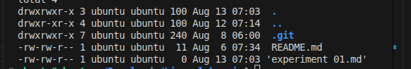

#    Heading 1
##   Heading 2
###  Heading 3

Plaing Text 

```bash
>> pwd
```

# The output is as follow

```

```
### Linux Basic Command
```bash
>> ls
```
Explanation : The ls Command list all the files and folder 

### The Output of the commands is as below

